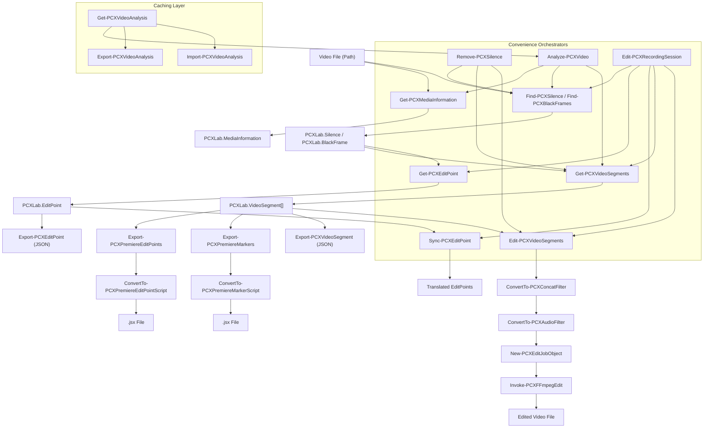
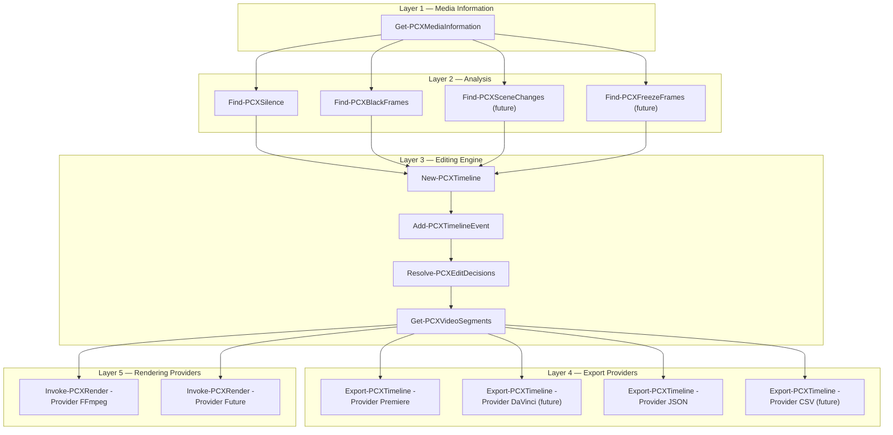
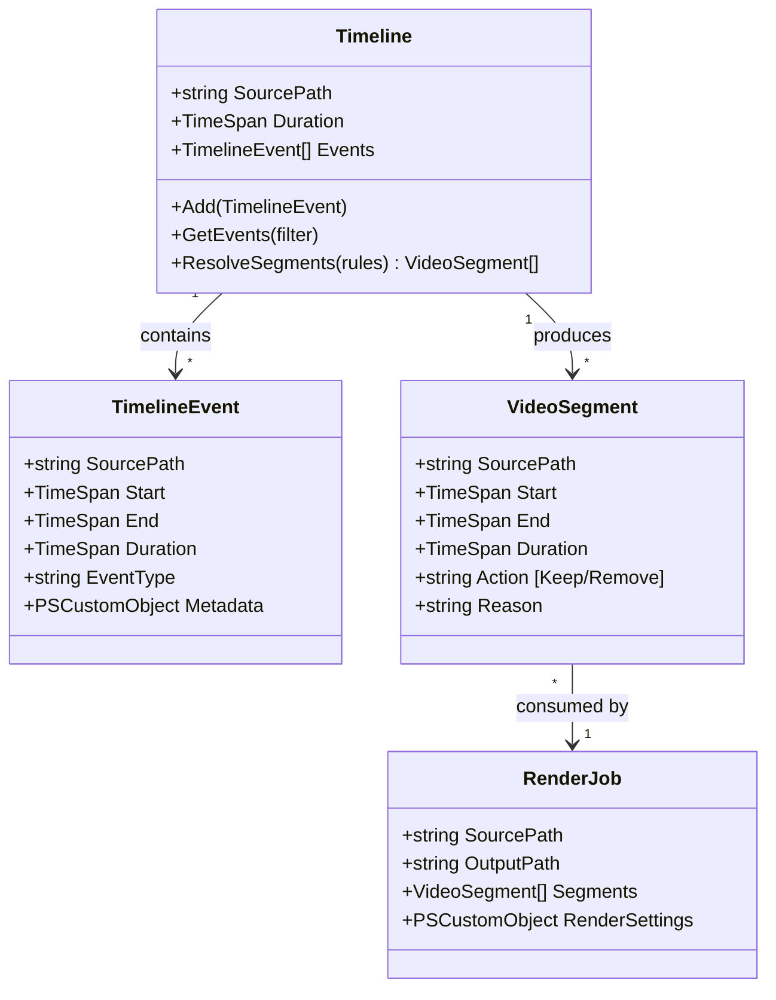

# PCXLab.VideoTools — Editing Subsystem Architecture Review

---

## 1. Current Editing Pipeline

### End-to-End Flow Diagram



### Transformation Sequence

| Step | Function | Input | Output | Transformation |
|------|----------|-------|--------|----------------|
| 1 | `Find-PCXSilence` | Video Path | `PCXLab.Silence[]` | FFmpeg silencedetect → parse → typed objects |
| 2 | `Find-PCXBlackFrames` | Video Path | `PCXLab.BlackFrame[]` | FFmpeg blackdetect → parse → typed objects |
| 3 | `Get-PCXVideoSegments` | `Silence[]` or `BlackFrame[]` or `EditPoint[]` | `PCXLab.VideoSegment[]` | Gap-fill algorithm: interleave Keep/Remove segments across the full video duration |
| 4 | `Optimize-PCXVideoSegments` | `VideoSegment[]` | `VideoSegment[]` | Remove tiny segments, merge adjacent same-action segments |
| 5 | `Edit-PCXVideoSegments` | `VideoSegment[]` | `FileInfo` | Build FFmpeg filter graph → execute FFmpeg → output file |
| 6 | `Export-PCXPremiereEditPoints` | `VideoSegment[]` or `Silence[]` | `.jsx FileInfo` | Convert segments to Premiere timecodes → generate ExtendScript |
| 7 | `Export-PCXPremiereMarkers` | `VideoSegment[]` or `Silence[]` | `.jsx FileInfo` | Convert segments to marker data → generate ExtendScript |
| 8 | `Get-PCXEditPoint` | `PCXLab.Silence` | `PCXLab.EditPoint` | Apply classification rules → emit recommended edit points |

---

## 2. Function Inventory — Editing Subsystem

### Public Functions

| Function | Responsibility | Inputs | Outputs | Dependencies | Responsibility Appropriate? |
|----------|---------------|--------|---------|--------------|---------------------------|
| [`Analyze-PCXVideo`](file:///c:/Projects/PCXLab.VideoTools/src/Modules/PCXLab.VideoTools/1.1.0/Public/Analysis/Analyze-PCXVideo.ps1) | Orchestrate full analysis of one file | Path, NoiseFloor, MinDuration | `PCXLab.VideoAnalysis` | `Get-PCXMediaInformation`, `Find-PCXSilence`, `Get-PCXVideoSegments`, `Measure-PCXSilence` | ⚠️ **Partially.** Embeds segment generation inside analysis. Analysis should discover facts; building segments is an editing concern. |
| [`Find-PCXSilence`](file:///c:/Projects/PCXLab.VideoTools/src/Modules/PCXLab.VideoTools/1.1.0/Public/Analysis/Find-PCXSilence.ps1) | Detect silence regions | Path or Analysis object | `PCXLab.Silence[]` | `Get-PCXAudioInformation`, `Invoke-PCXSilenceDetection`, `ConvertTo-PCXSilence` | ✅ Yes |
| [`Find-PCXBlackFrames`](file:///c:/Projects/PCXLab.VideoTools/src/Modules/PCXLab.VideoTools/1.1.0/Public/Analysis/Find-PCXBlackFrames.ps1) | Detect black frame regions | Path | `PCXLab.BlackFrame[]` | `Get-PCXVideoInformation`, `Invoke-PCXFFmpeg`, `ConvertTo-PCXBlackFrame` | ✅ Yes |
| [`Get-PCXEditPoint`](file:///c:/Projects/PCXLab.VideoTools/src/Modules/PCXLab.VideoTools/1.1.0/Public/Analysis/Get-PCXEditPoint.ps1) | Convert silence into edit recommendations | `PCXLab.Silence` | `PCXLab.EditPoint` | `Get-PCXEditPointRule`, `New-PCXEditPointObject` | ⚠️ **Misplaced.** Located in `Analysis/` but is an editing decision. Only works with Silence, not BlackFrame or other analysis types. |
| [`Get-PCXVideoSegments`](file:///c:/Projects/PCXLab.VideoTools/src/Modules/PCXLab.VideoTools/1.1.0/Public/Editing/Get-PCXVideoSegments.ps1) | Build Keep/Remove timeline from detected regions | `Silence[]`, `EditPoint[]`, or `BlackFrame[]` | `PCXLab.VideoSegment[]` | `Get-PCXVideoDuration`, `Add-PCXKeepSegment`, `Add-PCXRemoveSegment`, `Optimize-PCXVideoSegments` | ⚠️ **Partially.** Core logic is sound, but the variable name `$Silence` is misleading since it also accepts BlackFrame and EditPoint. |
| [`Edit-PCXVideoSegments`](file:///c:/Projects/PCXLab.VideoTools/src/Modules/PCXLab.VideoTools/1.1.0/Public/Editing/Edit-PCXVideoSegments.ps1) | Render edited video from segments | `VideoSegment[]`, OutputPath | `FileInfo` | `ConvertTo-PCXConcatFilter`, `ConvertTo-PCXAudioFilter`, `New-PCXEditJobObject`, `Invoke-PCXFFmpegEdit` | ⚠️ **Mixed.** Mixes rendering concerns (FFmpeg filter graph construction, audio settings) with the public API. Should delegate more to the rendering layer. |
| [`Remove-PCXSilence`](file:///c:/Projects/PCXLab.VideoTools/src/Modules/PCXLab.VideoTools/1.1.0/Public/Editing/Remove-PCXSilence.ps1) | One-command silence removal | Path | `FileInfo` | `Find-PCXSilence`, `Get-PCXVideoSegments`, `Edit-PCXVideoSegments` | ✅ Yes — clean orchestrator |
| [`Export-PCXPremiereEditPoints`](file:///c:/Projects/PCXLab.VideoTools/src/Modules/PCXLab.VideoTools/1.1.0/Public/Export/Export-PCXPremiereEditPoints.ps1) | Export Premiere .jsx edit script | `VideoSegment[]` or `Silence[]` | `.jsx FileInfo` | `Get-PCXVideoSegments`, `ConvertTo-PCXPremiereEditPointScript` | ⚠️ **Contains business logic.** Performs Silence→VideoSegment conversion inline. Accepts dual types, creating branching complexity. |
| [`Export-PCXPremiereMarkers`](file:///c:/Projects/PCXLab.VideoTools/src/Modules/PCXLab.VideoTools/1.1.0/Public/Export/Export-PCXPremiereMarkers.ps1) | Export Premiere .jsx marker script | `VideoSegment[]` or `Silence[]` | `.jsx FileInfo` | `Get-PCXVideoSegments`, `ConvertTo-PCXPremiereMarkerScript` | ⚠️ **Same dual-type issue** as above. Nearly identical boilerplate. |
| [`Export-PCXEditPoint`](file:///c:/Projects/PCXLab.VideoTools/src/Modules/PCXLab.VideoTools/1.1.0/Public/Export/Export-PCXEditPoint.ps1) | Export edit points to JSON | `EditPoint[]` | `FileInfo` | `New-PCXExportDocument` | ✅ Yes |
| [`Export-PCXSilence`](file:///c:/Projects/PCXLab.VideoTools/src/Modules/PCXLab.VideoTools/1.1.0/Public/Export/Export-PCXSilence.ps1) | Export silence to JSON | `Silence[]` | `FileInfo` | `New-PCXExportDocument` | ✅ Yes |
| [`Export-PCXVideoAnalysis`](file:///c:/Projects/PCXLab.VideoTools/src/Modules/PCXLab.VideoTools/1.1.0/Public/Export/Export-PCXVideoAnalysis.ps1) | Export analysis to JSON | `VideoAnalysis` | `FileInfo` | `New-PCXExportDocument` | ✅ Yes |
| [`Export-PCXVideoSegment`](file:///c:/Projects/PCXLab.VideoTools/src/Modules/PCXLab.VideoTools/1.1.0/Public/Export/Export-PCXVideoSegment.ps1) | Export segments to JSON | `VideoSegment[]` | `FileInfo` | `New-PCXExportDocument` | ✅ Yes |
| [`Edit-PCXRecordingSession`](file:///c:/Projects/PCXLab.VideoTools/src/Modules/PCXLab.VideoTools/1.1.0/Public/Synchronization/Edit-PCXRecordingSession.ps1) | Orchestrate multi-source editing | Reference + Sources | `FileInfo[]` | Many (analysis, sync, editing, export) | ⚠️ **Contains Write-Host.** Mixes UI output with business logic. Hard-coded to silence analysis only. |

### Private Functions (Editing-relevant)

| Function | Responsibility | Appropriate? |
|----------|---------------|-------------|
| [`Add-PCXKeepSegment`](file:///c:/Projects/PCXLab.VideoTools/src/Modules/PCXLab.VideoTools/1.1.0/Private/Editing/Add-PCXKeepSegment.ps1) | Factory for Keep segments | ✅ But trivial wrapper — could be inlined |
| [`Add-PCXRemoveSegment`](file:///c:/Projects/PCXLab.VideoTools/src/Modules/PCXLab.VideoTools/1.1.0/Private/Editing/Add-PCXRemoveSegment.ps1) | Factory for Remove segments | ✅ Same — trivial wrapper |
| [`Optimize-PCXVideoSegments`](file:///c:/Projects/PCXLab.VideoTools/src/Modules/PCXLab.VideoTools/1.1.0/Private/Editing/Optimize-PCXVideoSegments.ps1) | Clean/merge/sort segments | ✅ Well-defined responsibility |
| [`ConvertTo-PCXConcatFilter`](file:///c:/Projects/PCXLab.VideoTools/src/Modules/PCXLab.VideoTools/1.1.0/Private/Editing/ConvertTo-PCXConcatFilter.ps1) | Build FFmpeg filter graph from segments | ✅ But should live in a Rendering/FFmpeg folder, not Editing |
| [`ConvertTo-PCXAudioFilter`](file:///c:/Projects/PCXLab.VideoTools/src/Modules/PCXLab.VideoTools/1.1.0/Private/Editing/ConvertTo-PCXAudioFilter.ps1) | Build FFmpeg audio filter chain | ✅ Same — belongs in Rendering/FFmpeg |
| [`Invoke-PCXFFmpegEdit`](file:///c:/Projects/PCXLab.VideoTools/src/Modules/PCXLab.VideoTools/1.1.0/Private/Editing/Invoke-PCXFFmpegEdit.ps1) | Execute FFmpeg with EditJob | ✅ Same — belongs in Rendering/FFmpeg |
| [`Get-PCXVideoDuration`](file:///c:/Projects/PCXLab.VideoTools/src/Modules/PCXLab.VideoTools/1.1.0/Private/Editing/Get-PCXVideoDuration.ps1) | Get duration for segment generation | ⚠️ Misplaced in Editing. This is a media-info concern. |
| [`ConvertTo-PCXPremiereEditPointScript`](file:///c:/Projects/PCXLab.VideoTools/src/Modules/PCXLab.VideoTools/1.1.0/Private/Premiere/ConvertTo-PCXPremiereEditPointScript.ps1) | Generate Premiere ExtendScript | ✅ Correctly isolated in `Premiere/` |
| [`ConvertTo-PCXPremiereMarkerScript`](file:///c:/Projects/PCXLab.VideoTools/src/Modules/PCXLab.VideoTools/1.1.0/Private/Premiere/ConvertTo-PCXPremiereMarkerScript.ps1) | Generate Premiere marker ExtendScript | ✅ Correctly isolated |
| [`ConvertTo-PCXPremiereTimecode`](file:///c:/Projects/PCXLab.VideoTools/src/Modules/PCXLab.VideoTools/1.1.0/Private/Premiere/ConvertTo-PCXPremiereTimecode.ps1) | Convert seconds to Premiere timecode | ✅ Correctly isolated |
| [`New-PCXVideoSegmentObject`](file:///c:/Projects/PCXLab.VideoTools/src/Modules/PCXLab.VideoTools/1.1.0/Private/Models/New-PCXVideoSegmentObject.ps1) | Factory for VideoSegment | ✅ |
| [`New-PCXEditPointObject`](file:///c:/Projects/PCXLab.VideoTools/src/Modules/PCXLab.VideoTools/1.1.0/Private/Models/New-PCXEditPointObject.ps1) | Factory for EditPoint | ✅ |
| [`New-PCXSilenceObject`](file:///c:/Projects/PCXLab.VideoTools/src/Modules/PCXLab.VideoTools/1.1.0/Private/Models/New-PCXSilenceObject.ps1) | Factory for Silence | ⚠️ Embeds classification logic (thresholds) inside the model factory |
| [`New-PCXEditJobObject`](file:///c:/Projects/PCXLab.VideoTools/src/Modules/PCXLab.VideoTools/1.1.0/Private/Models/New-PCXEditJobObject.ps1) | Factory for EditJob | ⚠️ FFmpeg-specific (codec defaults). This is a rendering concern, not a domain model. |
| [`Get-PCXEditPointRule`](file:///c:/Projects/PCXLab.VideoTools/src/Modules/PCXLab.VideoTools/1.1.0/Private/Settings/Get-PCXEditPointRule.ps1) | Look up edit point rules by classification | ⚠️ Only works with silence classifications. Not extensible. |

---

## 3. Overlapping Responsibilities

### Business Logic Inside Exporters

- **`Export-PCXPremiereEditPoints`** and **`Export-PCXPremiereMarkers`** both contain `Silence → VideoSegment` conversion logic inline (lines 148–153 and 125–130 respectively). This is a transformation that belongs upstream.
- Both functions contain nearly identical type-detection and dual-input boilerplate (~30 lines duplicated).

### Editing Logic Inside Analysis

- **`Analyze-PCXVideo`** calls `Get-PCXVideoSegments` to embed segments inside the analysis object. Segment generation is an editing decision, not an analysis fact. This couples the analysis result to a specific editing interpretation.
- **`New-PCXSilenceObject`** contains classification thresholds (15s → RecordingBreak, 5s → EditCandidate). These are editing policies, not analysis facts.

### Editor-Specific Logic Leaking

- **`New-PCXEditJobObject`** defaults to `libx264` and `aac` codecs. These are FFmpeg-specific rendering choices embedded in the domain model.
- **`Edit-PCXVideoSegments`** directly reads audio settings, builds FFmpeg filter graphs, and manages sample rates. This is FFmpeg rendering logic inside a public editing function.

### Duplicated Transformations

- Silence-to-Segment conversion is performed by `Get-PCXVideoSegments` but is also triggered independently inside `Export-PCXPremiereEditPoints`, `Export-PCXPremiereMarkers`, and `Analyze-PCXVideo`.
- Duration retrieval (`Get-PCXVideoDuration`) wraps `Get-PCXVideoInformation` for a single property. This same information is already retrieved by `Analyze-PCXVideo` via `Get-PCXMediaInformation` but is not passed downstream.

### Unnecessary Conversions

- The `PCXLab.EditPoint` type has `Start`, `End`, and `Duration` as both `TimeSpan` and `Seconds` properties. Duration is passed as a parameter to `New-PCXEditPointObject` even though it is always `End - Start`.

---

## 4. Evaluation Against Engineering Principles

### KISS (Keep It Simple, Stupid)

| Issue | Severity |
|-------|----------|
| `Find-PCXSilence` accepts both `Path` and `Analysis` via parameter sets. The `ByAnalysis` set simply returns `$Analysis.Analysis.Silence`, which is a property accessor, not a detection operation. This creates a dual-purpose function. | 🔴 |
| `Export-PCXPremiereEditPoints` and `Export-PCXPremiereMarkers` both accept `Silence` OR `VideoSegment`, performing internal type branching. The caller should do the conversion. | 🔴 |
| `Get-PCXVideoSegments` variable `$Silence` holds `Silence`, `EditPoint`, or `BlackFrame` objects. The naming obscures intent. | 🟡 |

### DRY (Don't Repeat Yourself)

| Issue | Severity |
|-------|----------|
| Dual-input type detection boilerplate in `Export-PCXPremiereEditPoints` and `Export-PCXPremiereMarkers` is nearly identical (~30 lines each). | 🔴 |
| All seven `Export-PCX*` functions share the same pattern: collect pipeline → resolve path → ensure directory → build document → write JSON. No shared base function beyond `New-PCXExportDocument`. | 🟡 |
| `Export-PCXSilence`, `Export-PCXVideoSegment`, `Export-PCXEditPoint`, `Export-PCXVideoAnalysis` are structurally identical. Only the type name and collection name differ. | 🟡 |
| Duration is computed as both `TimeSpan` and `double` in every model factory. The pattern `StartSeconds = [Math]::Round($Start.TotalSeconds, 3)` appears in `New-PCXVideoSegmentObject`, `New-PCXEditPointObject`, `New-PCXSilenceObject`, and `New-PCXBlackFrameObject`. | 🟡 |

### SOLID — Single Responsibility Principle

| Issue | Severity |
|-------|----------|
| `Analyze-PCXVideo` is analysis + segment generation + statistics. Three responsibilities. | 🔴 |
| `Edit-PCXVideoSegments` is FFmpeg filter graph construction + audio processing configuration + output path resolution + rendering execution. | 🔴 |
| `New-PCXSilenceObject` is model factory + classification policy. | 🟡 |
| `Edit-PCXRecordingSession` is analysis + synchronization + editing + export + console output. | 🔴 |

### SOLID — Open/Closed Principle

| Issue | Severity |
|-------|----------|
| Adding a new analysis type (e.g., Scene Changes) requires modifying `Get-PCXVideoSegments` to accept the new type, modifying `Analyze-PCXVideo` to call the new analyzer, and modifying `New-PCXVideoAnalysisObject` to store the new results. Nothing is extensible without code changes. | 🔴 |
| Adding a new export target (e.g., DaVinci Resolve) requires creating entirely new `Export-PCX*` and `ConvertTo-PCX*` functions. There is no provider/adapter pattern. | 🟡 |
| `Get-PCXEditPoint` only works with `PCXLab.Silence`. It cannot produce edit points from `BlackFrame` or future analysis types without modification. | 🔴 |

### SOLID — Dependency Inversion

| Issue | Severity |
|-------|----------|
| `Edit-PCXVideoSegments` directly calls FFmpeg-specific functions. The editing layer depends on a concrete renderer, not an abstraction. | 🔴 |
| `ConvertTo-PCXPremiereEditPointScript` is hard-coded to Premiere's QE API. There is no export provider abstraction. | 🟡 (acceptable for now, since there's only one target) |

### Separation of Concerns

| Issue | Severity |
|-------|----------|
| Analysis objects contain editing decisions (segments). | 🔴 |
| Model factories contain business rules (silence classification). | 🟡 |
| Public editing functions contain rendering implementation details. | 🔴 |
| `Edit-PCXRecordingSession` mixes UI (Write-Host) with orchestration logic. | 🟡 |

---

## 5. Ideal Architecture — Greenfield Design

### If designing from scratch today, I would define five clean layers:



### Core Principles of the Ideal Design

1. **Analyzers produce analysis events only.** They never create segments, classifications, or editing decisions.
2. **The Timeline is the central domain object.** It collects heterogeneous analysis events and produces uniform editing decisions.
3. **Export and Rendering are providers.** They consume domain objects. They never define them.
4. **Classification is a separate, configurable policy.** It is not embedded in model factories.
5. **Every layer depends only on domain objects, never on specific analysis types or editor-specific types.**

### Migration from Today's Design

The migration is largely organizational. The actual logic is sound. What needs to change:

1. **Extract segments out of `PCXLab.VideoAnalysis`.** Analysis stores raw detections only.
2. **Introduce `PCXLab.TimelineEvent`** as the universal analysis event type.
3. **Refactor `Get-PCXVideoSegments` to accept `TimelineEvent[]`** instead of checking for specific type names.
4. **Move FFmpeg functions from `Private/Editing/` to `Private/Rendering/FFmpeg/`.**
5. **Remove dual-type acceptance** from Premiere exporters. They accept segments only.
6. **Extract classification logic** from `New-PCXSilenceObject` into a separate function.

---

## 6. Should a Timeline Object Exist?

### **Yes. Emphatically.**

The Timeline is the missing architectural keystone.

### Responsibilities

| Responsibility | Description |
|----------------|-------------|
| **Aggregation** | Collect heterogeneous analysis events (silence, black frames, scene changes, user annotations) into a single ordered collection. |
| **Time reference** | Hold the source path, total duration, and frame rate. All events are positioned relative to the timeline's time base. |
| **Query** | Enable filtering: "give me only silence events", "give me all events between 5:00 and 10:00", "give me all Keep segments". |
| **Edit decision generation** | Produce VideoSegments by applying rules to collected events. The algorithm in today's `Get-PCXVideoSegments` belongs here. |

### Ownership

The **Editing Engine layer** owns the Timeline. Analyzers produce events that are *added to* the Timeline, but they do not own it.

### Lifetime

A Timeline is created once per source media file. It accumulates events from multiple analysis passes, then produces segments on demand.

### What Belongs Inside Timeline

- Source path, duration, frame rate
- Collection of `TimelineEvent` objects
- Methods/functions to add events, query events, and generate segments

### What Must NEVER Belong Inside Timeline

- FFmpeg filter graphs or rendering logic
- Editor-specific data (Premiere timecodes, .jsx scripts)
- File I/O or export logic
- Analysis execution (the Timeline does not run FFmpeg)
- Synchronization offsets (those belong to the RecordingSession)

---

## 7. What Should Be the PRIMARY Domain Object?

### Evaluation

| Candidate | Pros | Cons | Verdict |
|-----------|------|------|---------|
| **VideoSegment** | Already exists. Clean Start/End/Action structure. Directly consumed by renderers and exporters. | Cannot represent analysis events. Binary Keep/Remove is too coarse for markers, annotations, or multi-source editing. | Good output object, but not the primary domain object. |
| **Timeline** | Central aggregation point. Natural place for event-to-segment transformation. Supports heterogeneous events. | Doesn't exist yet. Requires new abstraction. | ✅ **Best candidate for primary domain object.** |
| **EditDecision** | Captures the *intent* ("remove this region because silence detected"). | Overly abstract. The repository's actual workflow is simpler: detect regions → build segments. Adding an intermediate EditDecision layer between analysis and segments would violate KISS. | ❌ Premature abstraction. |
| **TimelineEvent** | Uniform representation of any analysis result anchored in time. | Good building block, but it's a *component* of the Timeline, not the primary orchestrating object. | Good secondary object, not primary. |
| **ClipRegion** | Industry term. | Adds nothing over VideoSegment. Unfamiliar to the codebase. | ❌ No advantage. |

### Recommendation

**The Timeline should be the primary domain object.** It owns a collection of `TimelineEvent` objects and produces `VideoSegment` objects as output. The architecture becomes:

```
Analysis → TimelineEvent[] → Timeline → VideoSegment[] → Renderers / Exporters
```

---

## 8. Should Video Segments Exist?

### **Yes. They are the correct output object.**

`VideoSegment` represents an unambiguous rendering instruction: "keep this region" or "remove this region." This is exactly what renderers and exporters need.

### What They Should Represent

A `VideoSegment` is a **rendering decision**, not an analysis result. It represents a contiguous time range of a source media file annotated with the editing action to apply.

### What Should Change

- **Remove segments from `PCXLab.VideoAnalysis`.** They are not analysis facts. They are derived by the editing engine.
- **Add an optional `Reason` property** so downstream consumers can understand *why* a segment exists (e.g., "silence detected", "black frame detected", "user annotation").
- **The segment should NOT carry the analysis source type.** Whether the segment was produced from silence, black frames, or user input is irrelevant to the renderer.

---

## 9. How Should Analysis Events Be Represented?

### Recommendation: **Independent TimelineEvent Objects**

Each analysis type should produce typed objects that share a common temporal interface:

| Property | Type | Description |
|----------|------|-------------|
| `SourcePath` | string | Source media file |
| `Start` | TimeSpan | Event start time |
| `End` | TimeSpan | Event end time |
| `Duration` | TimeSpan | Event duration |
| `EventType` | string | `'Silence'`, `'BlackFrame'`, `'SceneChange'`, etc. |
| `Metadata` | PSCustomObject | Type-specific data (e.g., noise floor for silence, luminance threshold for black frames) |

### Why Not the Alternatives?

| Alternative | Why Not |
|-------------|---------|
| **Segment metadata** | Segments are output. Analysis events are input. Mixing them conflates detection with decision. |
| **Completely separate typed objects** (current approach) | Current approach works but requires `Get-PCXVideoSegments` to maintain a whitelist of supported types. Every new analysis type requires modifying the segment builder. |
| **Timeline-embedded events** | Events should be independent objects that are *added to* a Timeline, not defined by it. |

### The `TimelineEvent` model enables:
- Adding new analysis types without modifying the segment builder
- Filtering events by type before segment generation
- Combining events from multiple analysis passes
- Future multi-source timeline composition

---

## 10. How Should Edit Points Be Produced?

### Current Approach

Edit Points come from Silence objects via `Get-PCXEditPoint`, which applies classification rules from `Settings.json`.

### Recommended Approach: **From TimelineEvents via the Timeline**

```
Analysis → TimelineEvent[] → Timeline.Resolve() → VideoSegment[]
```

Edit points should be produced by applying *configurable rules* to *any* timeline event type, not just silence.

### Advantages and Disadvantages

| Approach | Advantages | Disadvantages |
|----------|------------|---------------|
| **From analysis directly** (current) | Simple, one-hop. | Only works with silence. Adding black frame edit points requires a new function. Not extensible. |
| **From segments** | Segments already exist. | Circular: segments are the *output* of edit points, not the input. |
| **From the Timeline** (recommended) | Works with any event type. Configurable rules. Extensible. Single code path. | Requires introducing the Timeline concept. |
| **From another object** (EditDecision) | Captures intent. | Premature abstraction for current scale. |

### My Recommendation

The `PCXLab.EditPoint` type should be **retired as a primary concept** and replaced by the Timeline's segment resolution logic. The current `EditPoint` is essentially a "recommended cut" — which is what `VideoSegment` already represents. The rule-based filtering that `Get-PCXEditPoint` performs should become a configurable step in the Timeline's resolution pipeline.

If `EditPoint` is retained for backward compatibility, it should be producible from *any* `TimelineEvent`, not just Silence.

---

## 11. How Should Timeline Markers Be Produced?

### Current Approach

Markers are produced by `Export-PCXPremiereMarkers` from `VideoSegment` objects. Every segment becomes a range marker.

### Recommended Approach: **From TimelineEvents, not Segments**

Markers should represent **analysis events**, not editing decisions. A marker says "silence was detected here" or "black frame here" — that's an observation, not a Keep/Remove instruction.

### Most Scalable Approach

```
TimelineEvent[] → MarkerProvider.Convert() → Editor-specific markers
```

- Markers should be **independent of segments**. A user may want markers for all detected events, even events that do not produce edit decisions.
- Markers should be **configurable**: export only silence markers, only black frame markers, or both.
- Markers should carry the `EventType` as their label: "Silence - 3.5s", "BlackFrame - 1.2s".
- The Premiere marker exporter should be one of many possible **marker providers**.

This decouples markers from the Keep/Remove segment pipeline entirely.

---

## 12. Object Model Review

| Object | Type Name | Recommendation | Reasoning |
|--------|-----------|---------------|-----------|
| `PCXLab.VideoAnalysis` | Analysis container | **MODIFY** | Remove `Segments` from `Analysis` sub-object. Analysis should contain only raw detection results and statistics. Segments are a derived editing product. |
| `PCXLab.Silence` | Silence detection result | **MODIFY** | Remove `Classification` property. Classification is an editing policy, not an analysis fact. Add `EventType = 'Silence'` property to conform to a common `TimelineEvent` interface. |
| `PCXLab.BlackFrame` | Black frame detection result | **MODIFY** | Add `EventType = 'BlackFrame'` property. Otherwise already clean. |
| `PCXLab.VideoSegment` | Editing segment | **KEEP** | Clean, well-designed object. Consider adding optional `Reason` property. |
| `PCXLab.EditPoint` | Edit recommendation | **MODIFY → DEPRECATE** | Merge its rule-based filtering into the Timeline's segment resolution. The `EditPoint` concept adds an intermediate object that doesn't carry enough value to justify its existence separate from segments. If kept, make it work with any `TimelineEvent`, not just Silence. |
| `PCXLab.EditJob` | FFmpeg render specification | **MODIFY** | Move to rendering layer. Remove hard-coded codec defaults. Make codecs configurable via settings. |
| `PCXLab.MediaInformation` | Media metadata container | **KEEP** | Clean. Properly separated. |
| `PCXLab.VideoInformation` | Video stream metadata | **KEEP** | Clean. |
| `PCXLab.AudioInformation` | Audio stream metadata | **KEEP** | Clean. |
| `PCXLab.SilenceReport` | Silence statistics | **KEEP** | Well-scoped. |
| `PCXLab.ExportDocument` | Export envelope | **KEEP** | Simple, reusable. |
| `PCXLab.MediaSynchronization` | Multi-source sync result | **KEEP** | Outside editing subsystem scope. |
| `PCXLab.MediaSource` | Recording source definition | **KEEP** | Outside editing subsystem scope. |

---

## 13. Public API Naming Review

| Current Name | Issue | Recommendation |
|--------------|-------|----------------|
| `Get-PCXVideoSegments` | Plural noun. PowerShell convention is singular for pipeline output. | **Rename to `Get-PCXVideoSegment`** or `ConvertTo-PCXVideoSegment`. This is a functional clarity improvement, not style. The function converts detection events *into* segments. |
| `Edit-PCXVideoSegments` | "Edit" is vague. This function *renders* a video from segments. | **Rename to `Invoke-PCXVideoRender`** or `Export-PCXEditedVideo`. "Edit" implies modifying the segments themselves. |
| `Get-PCXEditPoint` | Located in `Analysis/` but it's an editing function. | **Move to `Editing/`**. Naming is acceptable. |
| `Find-PCXSilence` (ByAnalysis parameter set) | The `ByAnalysis` set is a getter, not a finder. | **Remove the ByAnalysis parameter set.** Use `Get-PCXSilence` for extraction from analysis objects. (This already exists!) |
| `Remove-PCXSilence` | Perfect. Clear intent. | **KEEP** |

---

## 14. Folder Organization Review

### Current Structure vs. Recommended

| Current Location | Content | Issue | Recommended Location |
|-----------------|---------|-------|---------------------|
| `Private/Editing/ConvertTo-PCXConcatFilter.ps1` | FFmpeg filter graph builder | Rendering concern, not editing | `Private/Rendering/FFmpeg/` |
| `Private/Editing/ConvertTo-PCXAudioFilter.ps1` | FFmpeg audio filter builder | Rendering concern | `Private/Rendering/FFmpeg/` |
| `Private/Editing/Invoke-PCXFFmpegEdit.ps1` | FFmpeg execution | Rendering concern | `Private/Rendering/FFmpeg/` |
| `Private/Editing/Get-PCXVideoDuration.ps1` | Media information query | Media concern | `Private/Common/` or `Private/Media/` |
| `Public/Analysis/Get-PCXEditPoint.ps1` | Edit point generation | Editing concern, not analysis | `Public/Editing/` |
| `Private/Premiere/` | Premiere script generators | ✅ Correctly isolated | Consider renaming to `Private/Export/Premiere/` for consistency |
| `Private/Models/New-PCXEditJobObject.ps1` | FFmpeg job spec | Rendering model | `Private/Rendering/FFmpeg/` or `Private/Models/` (acceptable) |
| `Private/Export/` | Empty directory | Unused | Remove or populate with shared export utilities |
| `Private/Cache/` | Empty directory | Unused | Remove |
| `Private/Classes/` | Empty directory | Unused | Remove |

---

## 15. Unnecessary Complexity

### Historical Artifacts

- **Four `Invoke-AllRecordingSessions*.ps1` scripts** at root level. V1 through V4. These are workflow evolution fossils. Only V4 is current.
- **Multiple `Run-VideoSilenceRemover*.ps1` scripts** at root level. Same pattern.
- **`V1FOlderChantew.ps1`** — appears to be a typo-named historical artifact.
- **`EditPoints.json`** at root level — sample/test data left in the repository root.

### Duplicate Pipelines

- `Remove-PCXSilence` and the manual `Find-PCXSilence | Get-PCXVideoSegments | Edit-PCXVideoSegments` pipeline accomplish the same thing. This duplication is *acceptable* — `Remove-PCXSilence` is a convenience wrapper and correctly delegates.
- However, `Analyze-PCXVideo` internally runs the same `Find-PCXSilence | Get-PCXVideoSegments` pipeline and bakes the result into the analysis object. This creates a second, invisible pipeline for segment generation.

### Premature Abstractions

- `PCXLab.EditPoint` as a separate type adds an abstraction layer between analysis and segments that doesn't carry sufficient additional information to justify its existence. It has the same temporal properties as a segment plus `Classification`, `Reason`, and `Confidence` — all of which could be metadata on the segment or event.

### Editor-Specific Abstractions Leaking

- `New-PCXEditJobObject` with `VideoCodec = 'libx264'` and `AudioCodec = 'aac'` hard-codes FFmpeg concepts into a domain model.

### Unnecessary Conversions

- `Duration` is passed as an explicit parameter to `New-PCXEditPointObject`, but it is always `End - Start`. Computed properties should be computed, not passed.

---

## 16. Hidden Technical Debt

1. **Type system fragility.** PSCustomObjects with `PSTypeName` lack compile-time safety. Type checking is done via string comparison (`$obj.PSTypeNames -contains 'PCXLab.Silence'`). A typo in a type name silently breaks the pipeline.

2. **No type validation hierarchy.** `Get-PCXVideoSegments` maintains a hardcoded whitelist of supported types. Adding `PCXLab.SceneChange` requires editing that whitelist.

3. **TimeSpan serialization brittleness.** `Restore-PCXVideoAnalysisTypes` manually reconstructs `TimeSpan` from `Ticks` after JSON round-trip. This is fragile and must be duplicated for every new object with TimeSpan properties.

4. **Settings duplication.** Default values for `NoiseFloor` and `MinimumDuration` are repeated in every function's parameter block (`Get-PCXSetting -Name 'Analysis.SilenceThreshold' -DefaultValue -35` appears in `Analyze-PCXVideo`, `Find-PCXSilence`, `Get-PCXVideoAnalysis`, `Remove-PCXSilence`, and `Edit-PCXRecordingSession`).

5. **`FunctionsToExport = '*'` in the module manifest.** This exports every function, including those intended to be private. A private function accidentally placed in the wrong folder becomes public.

6. **No integration test coverage for the editing pipeline.** Tests exist for individual functions (`ConvertTo-PCXConcatFilter.Tests.ps1`), but no test verifies the full `Silence → Segments → Render` pipeline.

7. **`Get-PCXSetting` has a duplicate line:** `$Value = $script:PCXSettings` appears twice (lines 41-43).

8. **`Get-PCXVideoDuration` calls `Get-PCXVideoInformation` every time.** During `Get-PCXVideoSegments`, this triggers an FFprobe call even when the caller (e.g., `Analyze-PCXVideo`) already has the media information. No caching or parameter pass-through.

9. **Export-PCXRecordingSession** has extensive manual sanitization of properties (lines 119-197). This hand-rolled serialization logic is brittle and must be maintained alongside the model factories.

---

## 17. Functions That Can Remain Mostly Unchanged

| Function | Why |
|----------|-----|
| `Find-PCXSilence` (ByPath set) | Clean, single-purpose detection. Only needs ByAnalysis set removed. |
| `Find-PCXBlackFrames` | Clean, well-structured. Nearly identical pattern to silence detection. |
| `Optimize-PCXVideoSegments` | Well-defined, testable, correct responsibility. |
| `ConvertTo-PCXConcatFilter` | Sound logic. Only needs to move folders. |
| `ConvertTo-PCXAudioFilter` | Excellent extensibility pattern with `$FilterMap`. |
| `Invoke-PCXFFmpegEdit` | Well-engineered with filter-script approach. Move folder only. |
| `ConvertTo-PCXPremiereTimecode` | Correct, isolated. |
| `ConvertTo-PCXPremiereEditPointScript` | Correct, well-isolated. |
| `ConvertTo-PCXPremiereMarkerScript` | Correct, well-isolated. |
| `Remove-PCXSilence` | Clean orchestrator. Will just update call targets. |
| `Measure-PCXSilence` | Clean aggregation. |
| `New-PCXExportDocument` | Simple, reusable envelope. |
| All `Import-PCX*` functions | Structural logic is fine. May need updates for new schemas. |
| All JSON `Export-PCX*` functions | Structural logic is fine. DRY improvements possible but not urgent. |

---

## 18. Functions That Should Be Redesigned

| Function | Why |
|----------|-----|
| **`Analyze-PCXVideo`** | Must stop generating segments. Should return analysis facts only: media info, silence[], black frames[], statistics. Segment generation belongs in the editing layer. |
| **`Get-PCXVideoSegments`** | Must accept a uniform `TimelineEvent` interface instead of hardcoding a whitelist of supported types. The gap-fill algorithm is correct but the input contract is too narrow. |
| **`Get-PCXEditPoint`** | Must work with any analysis event type, not just Silence. If kept, should accept `TimelineEvent` objects. Consider deprecating in favor of configurable rules applied during segment resolution. |
| **`Edit-PCXVideoSegments`** | Must be split: public API receives segments and delegates to a rendering provider. FFmpeg-specific logic moves to `Private/Rendering/FFmpeg/`. |
| **`Export-PCXPremiereEditPoints`** | Must drop Silence input support. Accept `VideoSegment[]` only. Dual-type logic is tech debt. |
| **`Export-PCXPremiereMarkers`** | Same as above. |
| **`New-PCXSilenceObject`** | Must extract classification logic into a separate function. The model factory should create the object; a classifier should classify it. |
| **`New-PCXVideoAnalysisObject`** | Must remove `$Segments` parameter. Analysis contains detections, not editing decisions. |
| **`Edit-PCXRecordingSession`** | Must remove `Write-Host` calls. Should use `Write-Verbose` or `Write-Information`. Must not hardcode to silence analysis. |

---

## 19. Phased Migration Strategy

### Phase 0 — Housekeeping (LOW RISK)

1. Clean up root-level script files (move to `Samples/` or remove)
2. Remove empty directories (`Private/Cache/`, `Private/Classes/`, `Private/Export/`)
3. Fix `Get-PCXSetting` duplicate line
4. Fix `FunctionsToExport` in manifest to be explicit

### Phase 1 — Folder Reorganization (LOW RISK)

1. Move `ConvertTo-PCXConcatFilter`, `ConvertTo-PCXAudioFilter`, `Invoke-PCXFFmpegEdit` from `Private/Editing/` to `Private/Rendering/FFmpeg/`
2. Move `Get-PCXVideoDuration` to `Private/Common/`
3. Move `Get-PCXEditPoint` from `Public/Analysis/` to `Public/Editing/`
4. Rename `Private/Premiere/` to `Private/Export/Premiere/`
5. All tests pass. All calls resolve via module-scoped function loading.

### Phase 2 — Extract Classification from Silence Factory (LOW RISK)

1. Create `Private/Analysis/Resolve-PCXSilenceClassification.ps1`
2. Move threshold logic out of `New-PCXSilenceObject`
3. Call classifier from `ConvertTo-PCXSilence` after object creation

### Phase 3 — Introduce TimelineEvent Interface (MEDIUM RISK)

1. Add `EventType` property to `PCXLab.Silence` and `PCXLab.BlackFrame` model factories
2. Refactor `Get-PCXVideoSegments` to check for a common interface (`Start`, `End`, `EventType`) instead of a hardcoded type whitelist
3. Rename `$Silence` variable to `$Events` inside `Get-PCXVideoSegments`

### Phase 4 — Decouple Segments from Analysis (MEDIUM RISK)

1. Remove `$Segments` from `New-PCXVideoAnalysisObject`
2. Update `Analyze-PCXVideo` to not call `Get-PCXVideoSegments`
3. Update `Restore-PCXVideoAnalysisTypes` to not restore segment types
4. Update JSON schema version to handle both old (with segments) and new (without) formats
5. Update any code that reads `$Analysis.Analysis.Segments`

### Phase 5 — Simplify Premiere Exporters (MEDIUM RISK)

1. Remove `Silence` input support from `Export-PCXPremiereEditPoints`
2. Remove `Silence` input support from `Export-PCXPremiereMarkers`
3. Remove `ByAnalysis` parameter set from `Find-PCXSilence`
4. Update any workflow scripts that pipe Silence directly to exporters

### Phase 6 — Extract Rendering Layer (HIGH RISK)

1. Create `Public/Editing/Invoke-PCXVideoRender.ps1` as the new public rendering API
2. Refactor `Edit-PCXVideoSegments` to delegate rendering to `Invoke-PCXVideoRender`
3. Or: rename `Edit-PCXVideoSegments` to `Invoke-PCXVideoRender` and provide an alias for backward compatibility
4. Move audio settings resolution into the rendering layer

### Phase 7 — Introduce Timeline Object (HIGH RISK)

1. Create `New-PCXTimelineObject.ps1`
2. Create `Add-PCXTimelineEvent.ps1`
3. Create `Resolve-PCXTimelineSegments.ps1` (the gap-fill algorithm extracted from `Get-PCXVideoSegments`)
4. Update `Get-PCXVideoSegments` to be a convenience wrapper over the Timeline API
5. Update `Edit-PCXRecordingSession` to use Timeline

---

## 20. Risk Classification

### LOW RISK

| Recommendation | Why Low Risk |
|----------------|-------------|
| Folder reorganization | Module loader auto-discovers files. No function signatures change. |
| Extract classification from silence factory | Internal change. No public API impact. |
| Clean up root-level scripts | No module impact. |
| Fix manifest `FunctionsToExport` | Reduces exported surface area. May break scripts depending on accidentally-public functions, but this is a correctness fix. |
| Fix `Get-PCXSetting` duplicate line | Bug fix. |
| Remove empty directories | No impact. |

### MEDIUM RISK

| Recommendation | Why Medium Risk |
|----------------|----------------|
| Introduce TimelineEvent interface | Adds properties to existing objects. Existing consumers that don't use the new property are unaffected, but JSON schema changes. |
| Decouple segments from analysis | Breaking change to `PCXLab.VideoAnalysis` shape. Code reading `.Analysis.Segments` will break. Requires schema migration. |
| Simplify Premiere exporters | Breaking change for callers piping `Silence` directly to exporters. Existing scripts must be updated to pipe through `Get-PCXVideoSegments` first. |
| Rename `Get-PCXVideoSegments` | Public API rename. Mitigate with alias. |

### HIGH RISK

| Recommendation | Why High Risk |
|----------------|--------------|
| Extract rendering layer | Changes the core rendering pipeline. `Edit-PCXVideoSegments` is the most-used rendering command. Must be backward compatible via alias or wrapper. |
| Introduce Timeline object | Fundamental architectural change. Affects the conceptual model, documentation, and workflow scripts. Must coexist with the current pipeline during migration. |
| Refactor `Edit-PCXRecordingSession` | Complex orchestrator with many dependencies. Changes risk breaking the multi-source workflow. |

---

## 21. Layered Architecture

### Layer 1 — Media Information

**Responsibility:** Discover facts about media files (codecs, duration, resolution, sample rate, streams).

**Functions:** `Get-PCXMediaInformation`, `Get-PCXVideoInformation`, `Get-PCXAudioInformation`, `Get-PCXMediaStreams`, `Get-PCXChapterInformation`, `Get-PCXSubtitleInformation`

**Dependencies:** FFprobe, MediaInfo (external tools)

**Editor-specific concepts:** None. ✅

---

### Layer 2 — Analysis

**Responsibility:** Detect temporal events in media files. Each analyzer produces a collection of events with start/end times.

**Functions:** `Find-PCXSilence`, `Find-PCXBlackFrames`, future `Find-PCXSceneChanges`, etc.

**Input:** Media file path + analysis parameters

**Output:** `TimelineEvent[]` (typed as `PCXLab.Silence`, `PCXLab.BlackFrame`, etc., but conforming to a common temporal interface)

**Editor-specific concepts:** None. ✅

**Key rule:** Analyzers must NEVER produce segments, classifications, or editing decisions. They discover facts.

---

### Layer 3 — Editing Engine

**Responsibility:** Transform analysis events into editing decisions (VideoSegments). This is where classification, filtering, and the gap-fill algorithm live.

**Functions:**
- `Get-PCXVideoSegments` (or `ConvertTo-PCXVideoSegment`) — converts events into segments
- `Optimize-PCXVideoSegments` — cleans the segment timeline
- Optionally: `New-PCXTimeline`, `Add-PCXTimelineEvent`, `Resolve-PCXTimelineSegments`

**Input:** `TimelineEvent[]` + configuration (rules, filters)

**Output:** `PCXLab.VideoSegment[]`

**Editor-specific concepts:** None. ✅

**Key rule:** This layer produces abstract editing decisions. It does not know about FFmpeg, Premiere, or any specific renderer or editor.

---

### Layer 4 — Export Providers

**Responsibility:** Translate domain objects (VideoSegments, TimelineEvents) into editor-specific or format-specific outputs.

**Functions:**
- `Export-PCXPremiereEditPoints` → `.jsx` for Premiere
- `Export-PCXPremiereMarkers` → `.jsx` for Premiere
- `Export-PCXVideoSegment` → `.json` (generic)
- Future: `Export-PCXDaVinciTimeline`, `Export-PCXFCPXML`, `Export-PCXCSV`, `Export-PCXEDL`

**Input:** `VideoSegment[]` or `TimelineEvent[]`

**Output:** Editor-specific files

**Editor-specific concepts:** Yes, by design. Each provider is editor-specific. The key is that **the domain objects they consume are NOT editor-specific.**

---

### Layer 5 — Rendering Providers

**Responsibility:** Produce edited media files from VideoSegments using a rendering engine.

**Functions:**
- `Invoke-PCXVideoRender` (public API) → delegates to provider
- `ConvertTo-PCXConcatFilter` → FFmpeg filter graph
- `ConvertTo-PCXAudioFilter` → FFmpeg audio filters
- `Invoke-PCXFFmpegEdit` → FFmpeg execution
- Future: DaVinci Resolve rendering, cloud rendering, etc.

**Input:** `VideoSegment[]` + rendering configuration

**Output:** Rendered media file

**Editor-specific concepts:** Yes, FFmpeg-specific. Properly isolated in `Private/Rendering/FFmpeg/`.

---

### Layer Dependency Rule

```
Media Information → Analysis → Editing Engine → Export Providers
                                              → Rendering Providers
```

**No layer may depend on a layer below it or beside it.**

- Export Providers NEVER define editing objects.
- Rendering Providers NEVER define editing objects.
- The Editing Engine NEVER knows about FFmpeg or Premiere.
- Analysis NEVER knows about segments or editing decisions.

---

## 22. Challenging My Own Recommendations

### Alternative Architecture: Event Sourcing

Instead of a Timeline that produces segments, every user action and analysis result could be an immutable event in an event log. Segments would be derived by replaying the event log.

**Why this could be better:**
- Full audit trail of every editing decision
- Undo/redo for free
- Time-travel debugging
- Multi-user collaboration support

**Why I chose against it:**
- Massive over-engineering for a PowerShell CLI tool
- Violates KISS to an extreme degree
- The repository is "relatively young" — the team needs simplicity now
- Event sourcing adds operational complexity (event store, projections, versioning)
- No current requirement for undo, audit, or collaboration

### Alternative Architecture: No Timeline Object

Keep the current design but just clean it up. Fix the responsibility leaks, move files around, but don't introduce a Timeline abstraction.

**Why this could be better:**
- Minimal change. Lower migration risk.
- The current `Get-PCXVideoSegments` works. It's a function that converts events to segments. A "Timeline" is just a wrapper around that function.
- PowerShell is not an OOP language. Introducing rich domain objects fights the language's strengths.

**Why I chose against it:**
- Without a Timeline, every new analysis type requires modifying `Get-PCXVideoSegments` to add its type to the whitelist. This violates Open/Closed.
- Without a central aggregation point, combining events from multiple analysis types (e.g., silence AND black frames) requires the caller to manually concatenate arrays and sort them. This is error-prone.
- A Timeline doesn't need to be a complex OOP class. In PowerShell, it can be a PSCustomObject with a collection of events and a function that resolves segments. That's KISS-compatible.

### Alternative Architecture: Provider Pattern for Everything

Make analysis, editing, exporting, and rendering all pluggable providers selected by name.

**Why this could be better:**
- Maximum extensibility
- Uniform architecture
- Plugin ecosystem

**Why I chose against it:**
- Over-abstraction for current scale. There's one analysis engine (FFmpeg), one renderer (FFmpeg), and one editor target (Premiere). Building a provider registry, discovery, and dispatch mechanism for single-implementation abstractions violates YAGNI.
- Providers make sense for Export and Rendering (multiple targets are explicitly planned). They don't yet make sense for Analysis (FFmpeg is the only engine).

---

## 23. Final Recommendation

### Core Domain Model



> [!IMPORTANT]
> `PCXLab.Silence` and `PCXLab.BlackFrame` continue to exist as concrete subtypes of the `TimelineEvent` concept. They are not replaced. They gain an `EventType` property and conform to the common interface, allowing the editing engine to treat all events uniformly.

### Overall Pipeline

```
 ┌─────────────────────────────────────────────────────┐
 │                    Media File                       │
 └─────────────┬───────────────────────────────────────┘
               │
 ┌─────────────▼───────────────────────────────────────┐
 │         Layer 1: Media Information                  │
 │         Get-PCXMediaInformation                     │
 └─────────────┬───────────────────────────────────────┘
               │
 ┌─────────────▼───────────────────────────────────────┐
 │         Layer 2: Analysis                           │
 │         Find-PCXSilence → PCXLab.Silence[]          │
 │         Find-PCXBlackFrames → PCXLab.BlackFrame[]   │
 │         Find-PCXSceneChanges → (future)             │
 │                                                     │
 │         All output: TimelineEvent interface          │
 └─────────────┬───────────────────────────────────────┘
               │
 ┌─────────────▼───────────────────────────────────────┐
 │         Layer 3: Editing Engine                     │
 │                                                     │
 │         TimelineEvent[] → Timeline                  │
 │         Timeline.Resolve(rules) → VideoSegment[]    │
 │                                                     │
 │         Configurable: which events to include,      │
 │         which to ignore, minimum durations,         │
 │         classification rules                        │
 └──────────┬──────────────────────┬───────────────────┘
            │                      │
 ┌──────────▼──────────┐ ┌────────▼────────────────────┐
 │  Layer 4: Export    │ │  Layer 5: Rendering          │
 │                     │ │                              │
 │  Premiere .jsx      │ │  FFmpeg (current)            │
 │  JSON               │ │  Future providers            │
 │  CSV (future)       │ │                              │
 │  EDL (future)       │ │  VideoSegment[] → Render     │
 │  FCPXML (future)    │ │       → Edited media file    │
 │  DaVinci (future)   │ │                              │
 └─────────────────────┘ └─────────────────────────────┘
```

### Long-Term Evolution Path

1. **Immediate (Phases 0-2):** Housekeeping, folder reorganization, extract classification. Zero public API changes. Repository improves without any consumer impact.

2. **Short-term (Phases 3-5):** Introduce TimelineEvent interface, decouple segments from analysis, simplify exporters. Minor breaking changes to `VideoAnalysis` shape and exporter inputs. Scriptable migration.

3. **Medium-term (Phase 6):** Extract rendering layer. `Edit-PCXVideoSegments` becomes a thin wrapper over `Invoke-PCXVideoRender`. Backward-compatible alias provided.

4. **Long-term (Phase 7):** Introduce Timeline object. This enables combining multiple analysis types, configurable resolution rules, and sets the stage for multi-editor export. The editing engine becomes truly editor-independent.

5. **Future:** Add new analyzers (scene changes, freeze frames, AI detections) as functions that return `TimelineEvent` objects. Add new export providers. Add new rendering providers. **None of these additions require modifying the core editing engine.**

---

> [!CAUTION]
> **This review is complete. No files have been modified. No code has been generated. No implementation has begun.**
>
> Waiting for your approval before proceeding to implementation planning.
