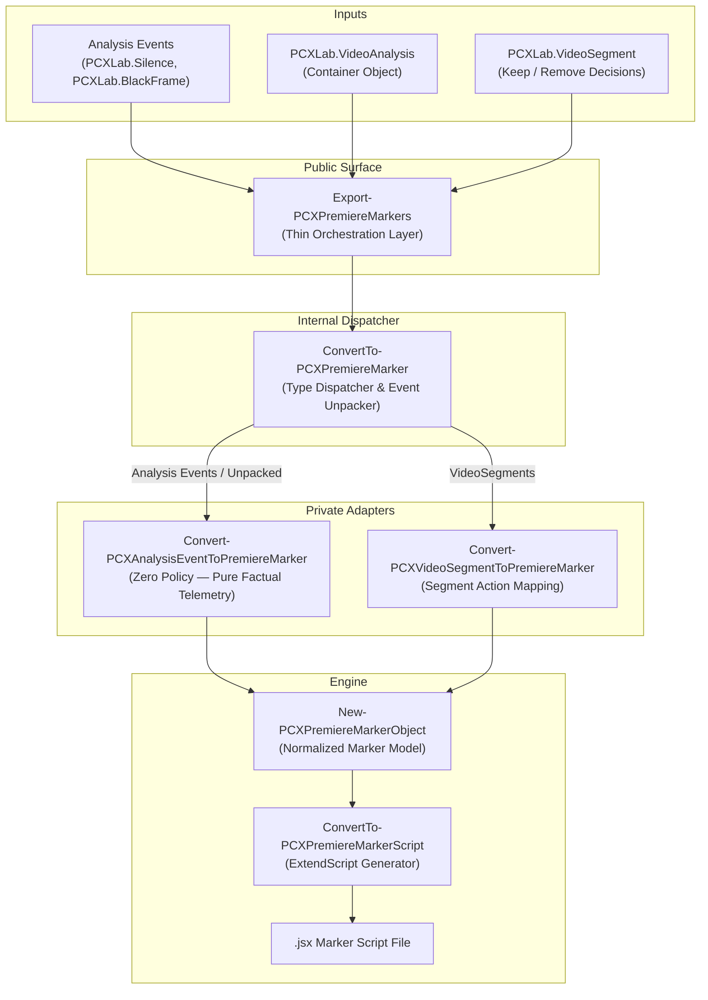

# Walkthrough — Commit 10: Analysis Visualization in Premiere Pro

## Overview

We completed the implementation of analysis visualization capabilities for **PCXLab.VideoTools** using a unified, decoupled **Adapter Architecture**.

Adobe Premiere Pro sequence markers can now be exported directly from:
1. **Raw Analysis Events** (e.g. `Find-PCXSilence`, `Find-PCXBlackFrames`, and future detectors) without applying any editing heuristics or policies.
2. **Complete Analysis Containers** (`Analyze-PCXVideo`), automatically unpacking constituent silence and black frame events into color-coded and classified markers.
3. **Video Segments** (`Get-PCXVideoSegments`), preserving 100% backward compatibility with existing segment marker exports.

---

## Architectural Implementation

---

## Changes Made

### 1. Normalized Internal Marker Model
- [New-PCXPremiereMarkerObject.ps1](file:///c:/Projects/PCXLab.VideoTools/src/Modules/PCXLab.VideoTools/1.1.0/Private/Models/New-PCXPremiereMarkerObject.ps1): Introduces the `PCXLab.PremiereMarker` model (`StartSeconds`, `EndSeconds`, `DurationSeconds`, `Name`, `Comments`, `MarkerType`, `ColorIndex`), completely decoupling marker generation from concrete domain objects.

### 2. Private Adapters & Dispatcher
- [Convert-PCXAnalysisEventToPremiereMarker.ps1](file:///c:/Projects/PCXLab.VideoTools/src/Modules/PCXLab.VideoTools/1.1.0/Private/Premiere/Convert-PCXAnalysisEventToPremiereMarker.ps1): Converts raw analysis events (`PCXLab.Silence`, `PCXLab.BlackFrame`, or generic `Test-PCXAnalysisEvent`) to normalized markers. Preserves exact detector timestamps and classifications with **zero editing heuristics** (no merging, trimming, or keep/remove alteration).
- [Convert-PCXVideoSegmentToPremiereMarker.ps1](file:///c:/Projects/PCXLab.VideoTools/src/Modules/PCXLab.VideoTools/1.1.0/Private/Premiere/Convert-PCXVideoSegmentToPremiereMarker.ps1): Converts editing video segments into decision markers (`VideoSegment - Keep` / `VideoSegment - Remove`).
- [ConvertTo-PCXPremiereMarker.ps1](file:///c:/Projects/PCXLab.VideoTools/src/Modules/PCXLab.VideoTools/1.1.0/Private/Premiere/ConvertTo-PCXPremiereMarker.ps1): Internal dispatcher that routes supported input types, unpacks `PCXLab.VideoAnalysis` containers, and rejects invalid inputs with descriptive error messages.

### 3. Generator & Public Cmdlet
- [ConvertTo-PCXPremiereMarkerScript.ps1](file:///c:/Projects/PCXLab.VideoTools/src/Modules/PCXLab.VideoTools/1.1.0/Private/Premiere/ConvertTo-PCXPremiereMarkerScript.ps1): Updated to consume normalized marker objects, generating ExtendScript JSX payloads with sequence marker creation routines.
- [Export-PCXPremiereMarkers.ps1](file:///c:/Projects/PCXLab.VideoTools/src/Modules/PCXLab.VideoTools/1.1.0/Public/Export/Export-PCXPremiereMarkers.ps1): Refactored to act as a thin orchestration layer handling pipeline accumulation, single-source invariant verification, default artifact path resolution (`<Source>-PremiereMarkers.jsx`), and file IO.

---

## Verification & Test Results

### Automated Tests Executed
1. **[ConvertTo-PCXPremiereMarker.Tests.ps1](file:///c:/Projects/PCXLab.VideoTools/Tests/Private/ConvertTo-PCXPremiereMarker.Tests.ps1)**:
   - PCXLab.VideoSegment conversion to normalized marker
   - PCXLab.Silence conversion with factual classification
   - PCXLab.BlackFrame conversion
   - PCXLab.VideoAnalysis container unpacking
   - Descriptive error throwing for unsupported inputs
2. **[Export-PCXPremiereMarkers.Tests.ps1 (Public)](file:///c:/Projects/PCXLab.VideoTools/Tests/Public/Export-PCXPremiereMarkers.Tests.ps1)**:
   - VideoSegment export to `.jsx`
   - Raw silence event export without editing policy
   - Raw black frame event export
   - VideoAnalysis container export
   - Sequence time offset calculation
   - Default output path resolution
   - Rejection of invalid objects
3. **[Export-PCXPremiereMarkers.Tests.ps1 (Export)](file:///c:/Projects/PCXLab.VideoTools/Tests/Export/Export-PCXPremiereMarkers.Tests.ps1)**:
   - Pipeline regression testing

### Test Suite Execution
- Running all Public, Export, and Private test suites (`Invoke-Pester Tests/Public, Tests/Export, Tests/Private`): **97 passed, 0 failed**.
